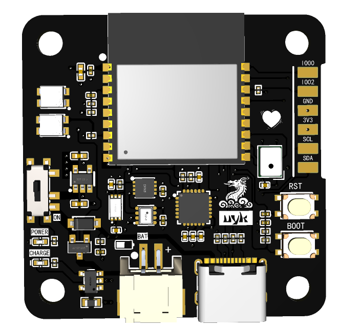
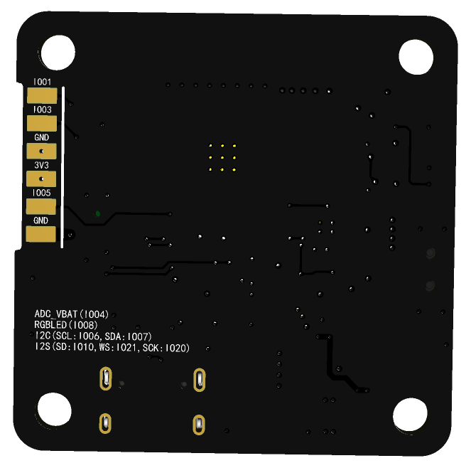
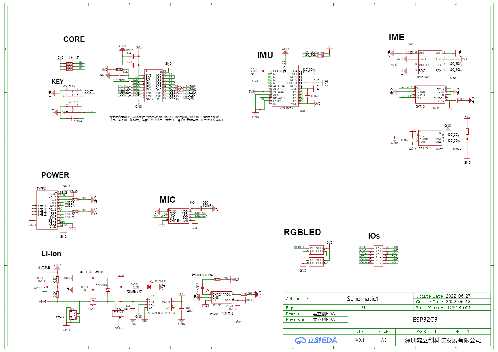

##### 预览：

##### 下载接口：

typec - 内置USB

① 因使用内置USB，故 Mircopython, LuatOS, Platformio(Arduino) 不可用，只可用 espidf。

② 按下RST按键后，芯片复位，电脑上连接这该板子的串口将会断开，需重新手动连接。

##### 板载资源：

* 光照传感器 BH1750
* 温湿度传感器 SHT30
* 大气压传感器 BMP280
* 惯性传感器 MPU6050
* 彩灯 WS2812(3528)
* 硅麦 MSM261S4030H0R
* 锂电池充放电电路

