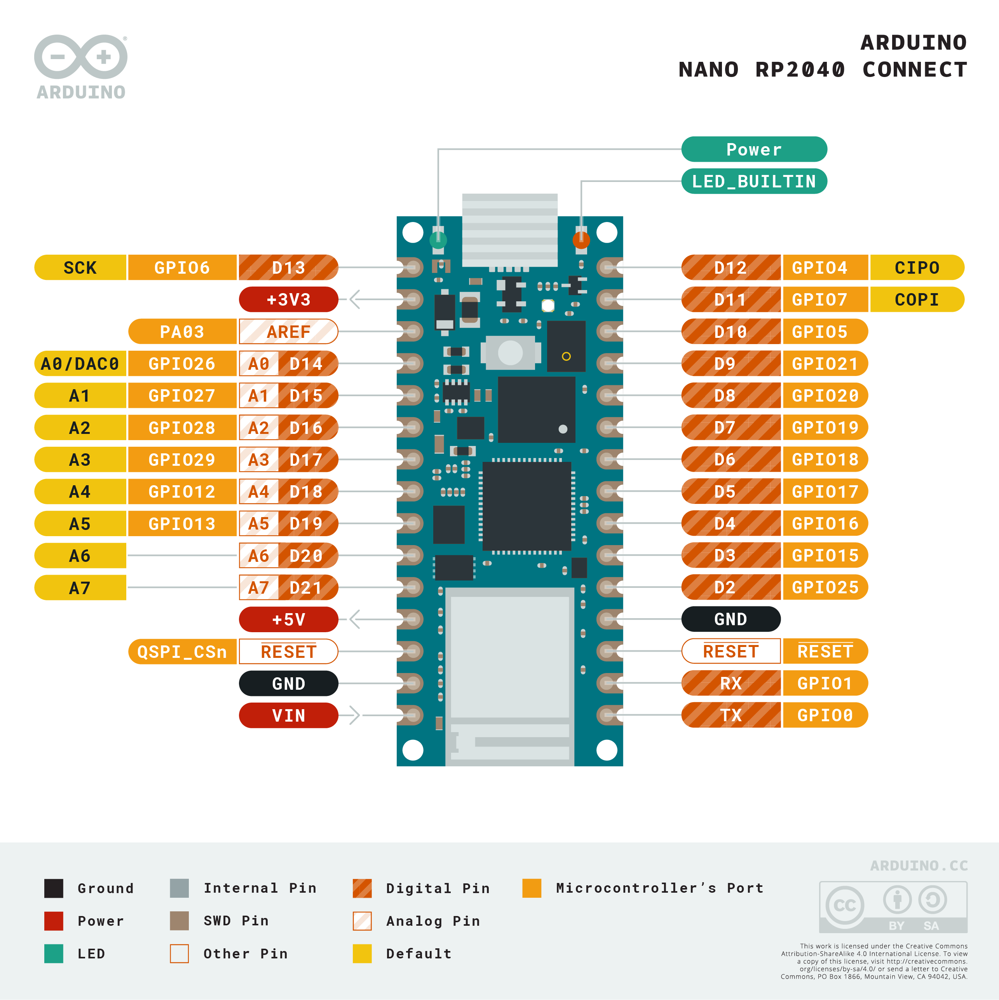
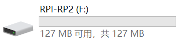
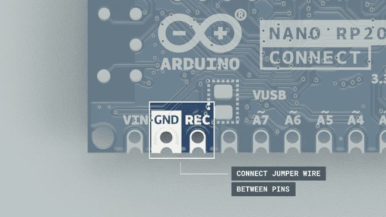
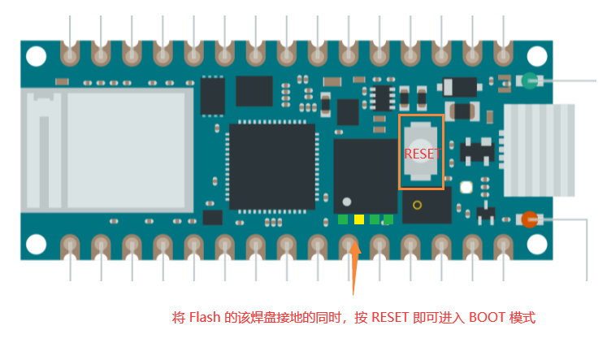

#### PINOUT

#### 进入 `BOOT` 模式

进入 boot 模式的现象：电脑上会显示个大容量设备（其实是8MB）。

##### 方法：

在 REC & GND 短接的同时（个人用的是镊子），按下 RESET，松开 RESET，即可

##### 原理：

将 flash 的 spi_cs 的电平拉低，然后重启。

#### micropython

使用前需将对应的 uf2 文件拖入到大容量设备中。

* uf2：
  * thonny：https://micropython.org/download/ARDUINO_NANO_RP2040_CONNECT/
  * openmv：https://github.com/openmv/openmv/releases

* openmv：https://docs.arduino.cc/tutorials/nano-rp2040-connect/rp2040-openmv-setup
  * 编辑 容量盘的 `main.py`

* base：https://docs.arduino.cc/learn/programming/arduino-and-python#openmv-examples
* demo：https://docs.arduino.cc/tutorials/nano-rp2040-connect/rp2040-python-api

#### 深度清除设备

进入 BOOT 模式后，刷入 [flash_nuke.uf2][https://forum.micropython.org/download/file.php?id=1388&sid=738edbd47c8db321e757b118c1517f3b] 固件，清除 flash 原有内容。