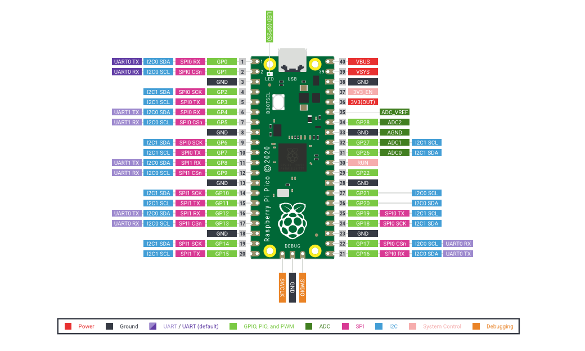

官网：https://pico.org.cn/

初始固件：https://micropython.org/download/rp2-pico/

Arduino固件：https://arduino-pico.readthedocs.io/en/latest/install.html#uploading-sketches

Thonny：https://link.zhihu.com/?target=https%3A//thonny.org/

Micropython固件：https://www.raspberrypi.com/documentation/microcontrollers/micropython.html#documentation

--------------

详细使用：https://zhuanlan.zhihu.com/p/507792299