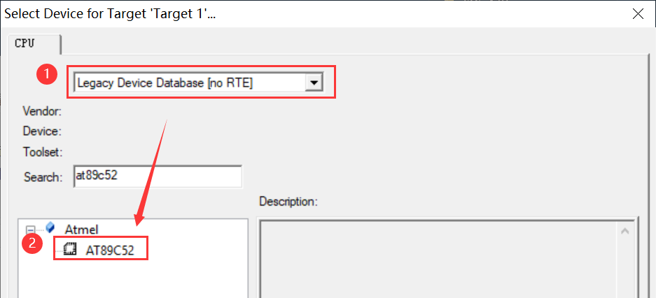
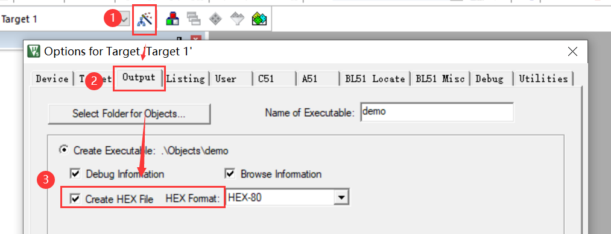
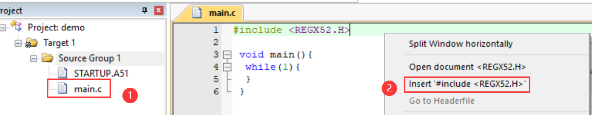
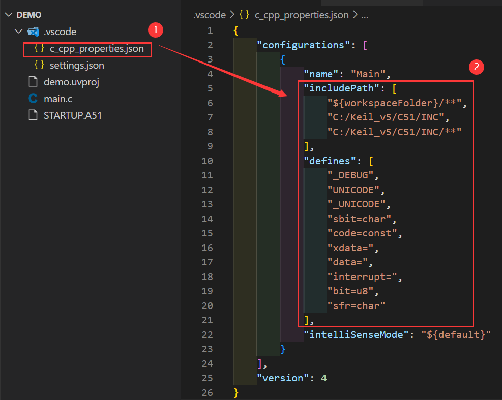
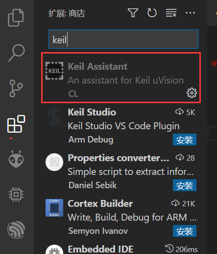

#### 新建项目

* 选择芯片 `AT89C52`



* 设置编译时生成HEX文件



* 编写基本代码



#### VS Code



```json
"includePath": [
    "${workspaceFolder}/**",
    "C:/Keil_v5/C51/INC",
    "C:/Keil_v5/C51/INC/**"
],
"defines": [
    "_DEBUG",
    "UNICODE",
    "_UNICODE",
	"sbit=char",
	"code=const",
	"xdata=",
	"data=",
	"interrupt=",
	"bit=u8",
    "sfr=char"
]
```

注：勿启用 Keil Assistant 插件，该插件会去除自己配置的 includePath，导致找不到头文件


