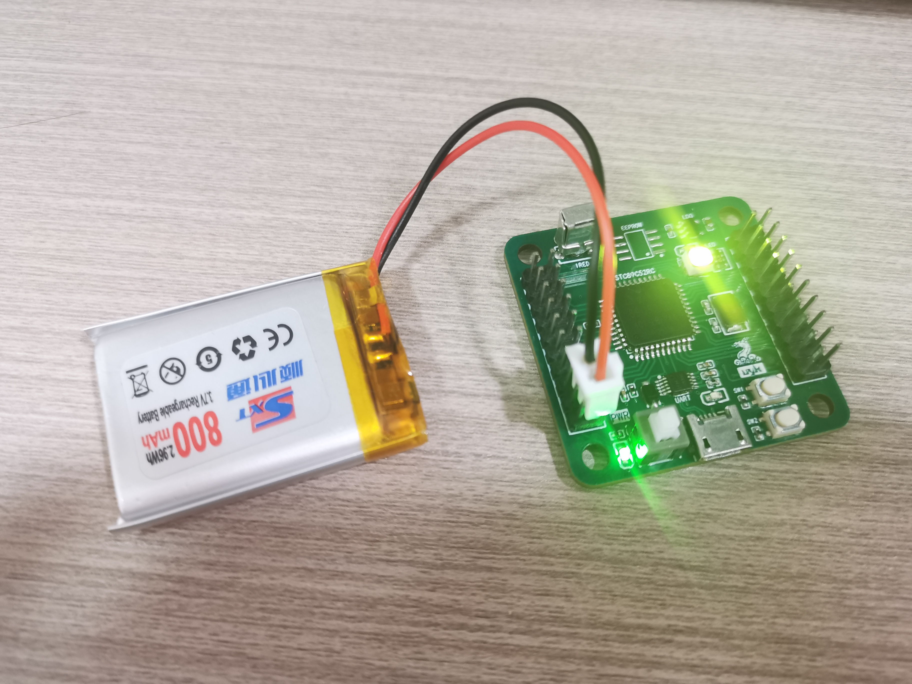

开源工程链接：https://www.oshwhub.com/aris.95/uyk-stc89c52rc-core

* 4层板，大小仅为 40mm*40mm，非常迷你。

#### 预览：

#### 板载资源：

* 按键*2

* rgbled\*1 + 普通led\*1

* eeprom at24cxx \*1

* 红外接收 hs0038 \*1

* 下载电路 ch340e

* 3v3 ldo (me6211/ap2112k)

#### 现存问题：

详看 `workspace\README.md`

#### 供电：

因为STC89C52RC的供电范围是3.6~5.5v（还可以更低电压），所以可以用锂电池供电，只不过时钟频率会有所降低。

#### 其他：

* 晶振为 5032 的 11.0592MHz 的贴片晶振（3215晶振老不起振才用这个）

* 不带自动下载电路（因为这个自动下载电路我自己没调成功过）

* 若要铁板烧（加热台焊接），勿在华秋打板，他那板子铁板烧会掉色，还是嘉立创板子质量好

* 用4层板是因为容易画，并且免费打板。虽然现在四层不能选颜色了，不过绿色也挺好看的

* 若要使用该板，勿按照bom表下单，不准确，需要看原理图有哪些器件。 阻容主要使用的是 0402 10kΩ电阻，0402 100nF电容，1206 10kΩ排阻，0603 led。

* 使用了P4口，包括中断