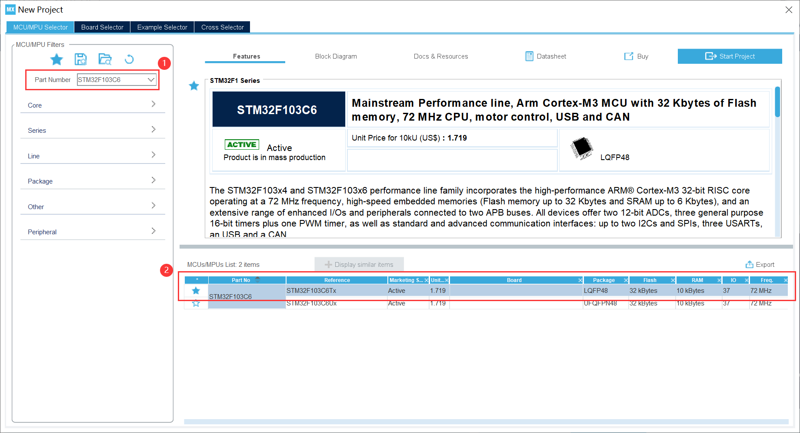
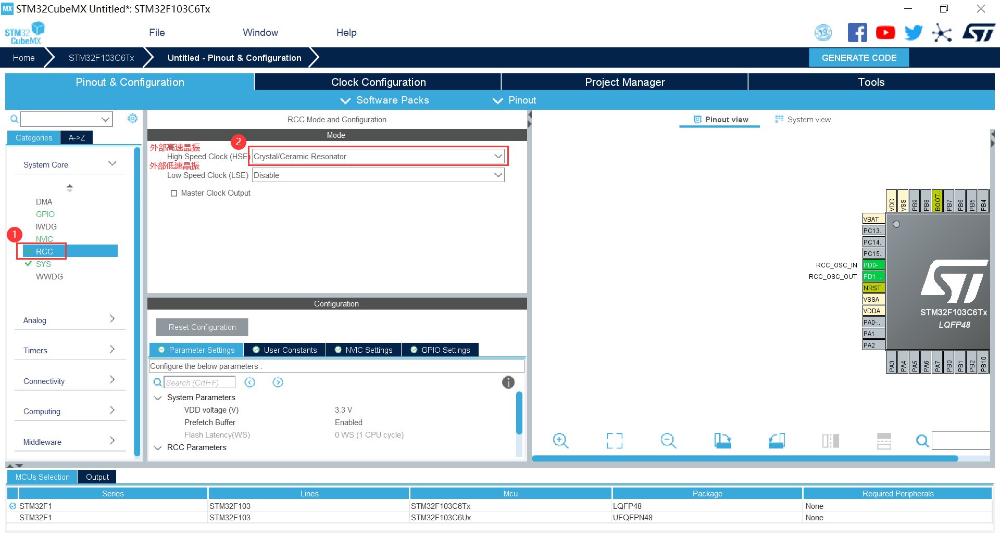
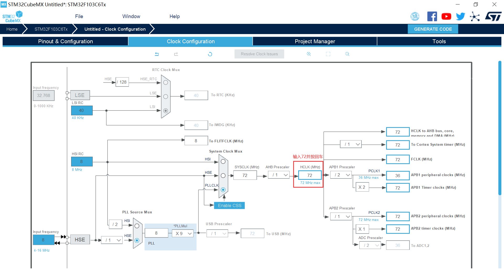
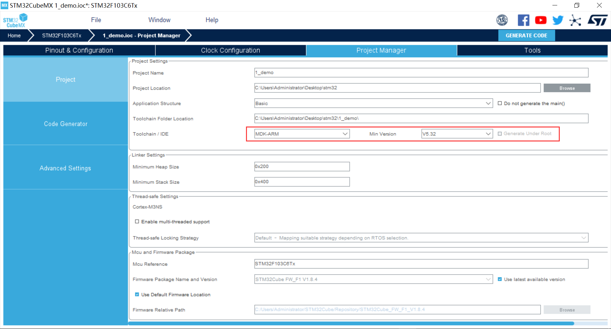
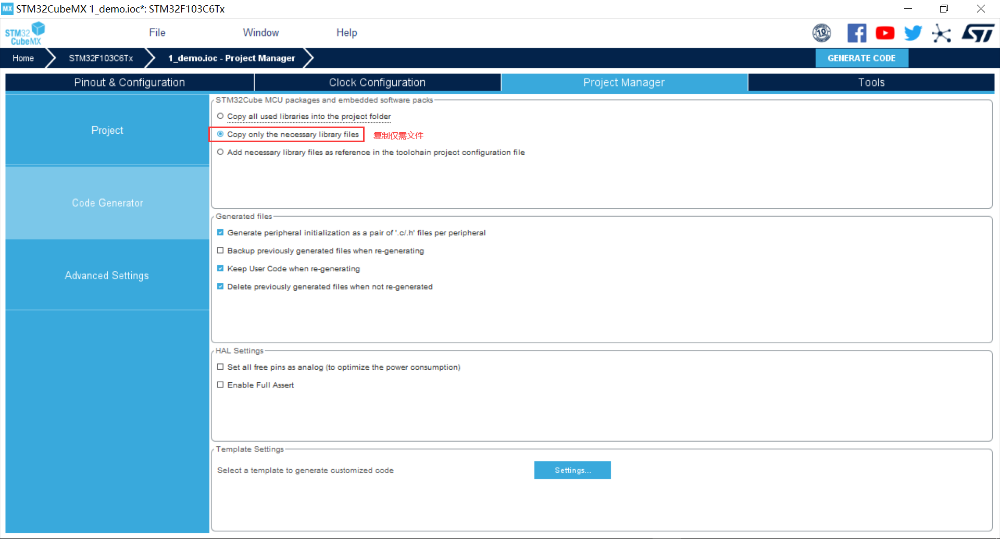
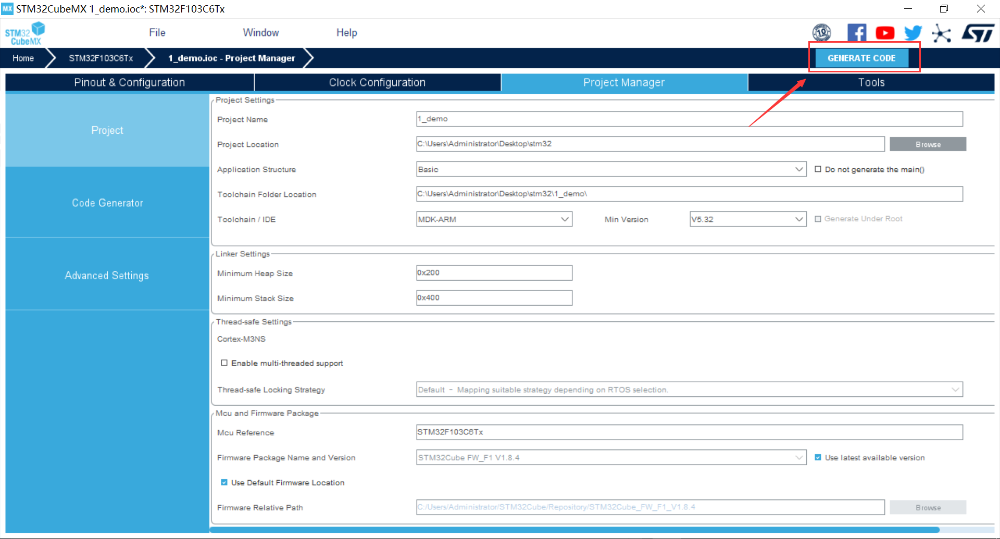
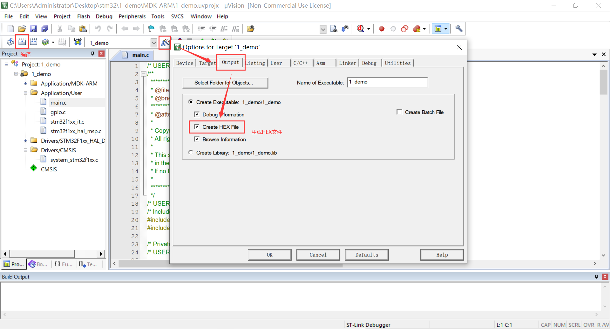
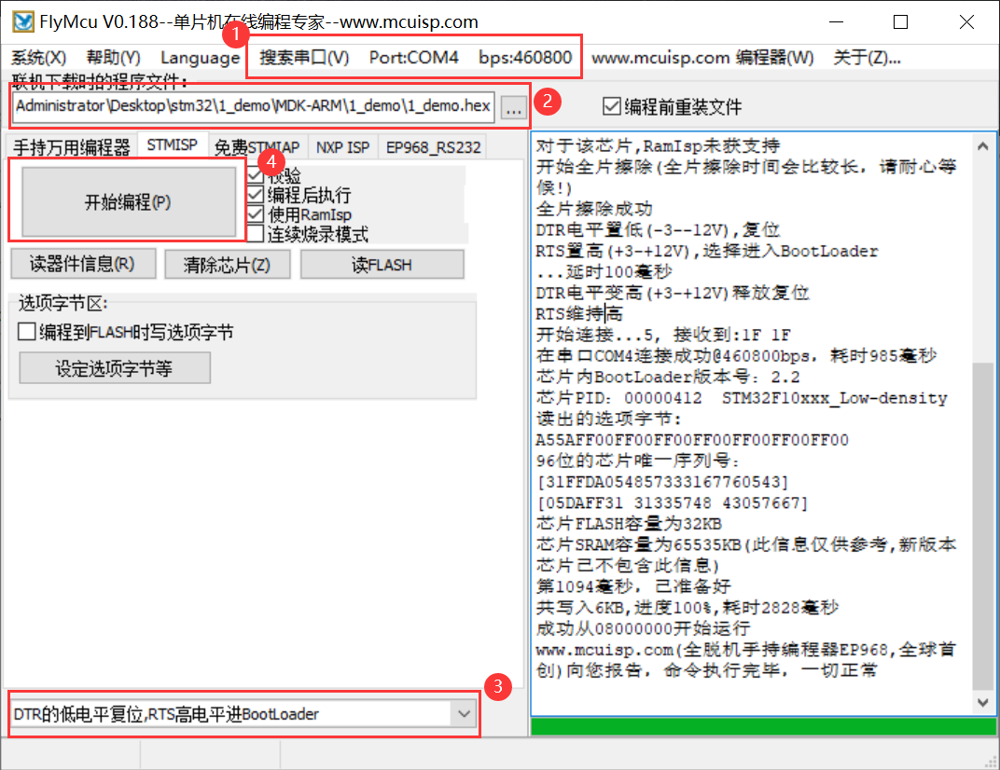
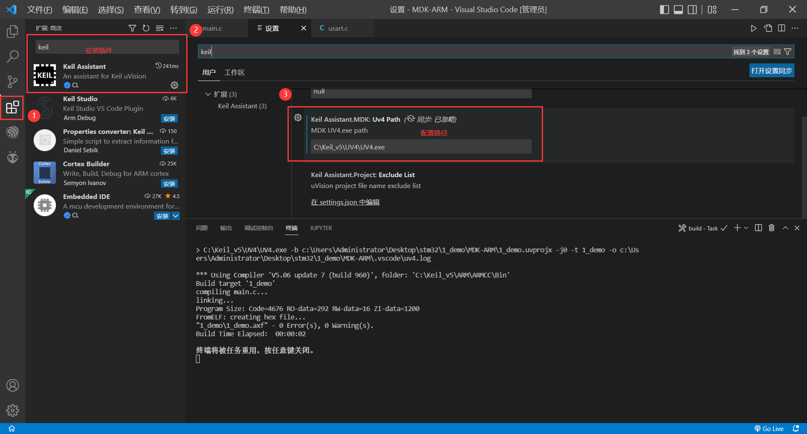
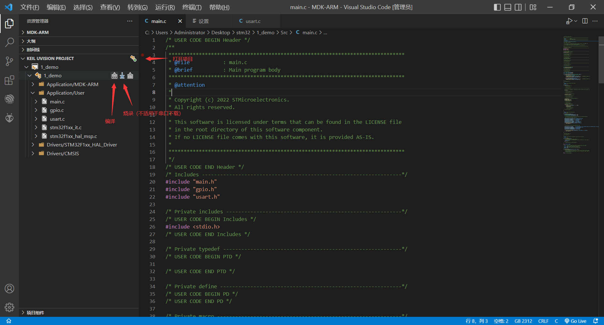

[TOC]

### 1. 新建项目

### 2. 时钟配置

#### 使能外部高速晶振

#### 配置时钟树

STM32 有内部晶振，也可以配置为外部低速晶振（32.768k）和外部高速晶振（8M）。

| 时钟源             | **使用**                           |
| ------------------ | ---------------------------------- |
| 外部低速时钟 LSE   | 须配置 RTC 和 RCC 后才能配置该时钟 |
| 内部低速时钟 LSI   | 须配置 RTC 后才能配置该时钟        |
| 外部高速时钟 HSE   | 须配置 RCC 后才能配置该时钟        |
| 外部低速时钟 HSI   | 可直接配置                         |
| 内部主时钟输出 MCO | 须在 RCC 中配置后才能配置该时钟    |

此处的配置为：

- 1 选择外部时钟HSE 8MHz  
- 2 PLL锁相环倍频9倍
- 3 系统时钟来源选择为PLL
- 4 设置APB1分频器为 /2

### 3. 配置项目

### 4. 生成项目

### 5. 固件烧录

#### 编译

#### 烧录

### 6. VSCode - Keil

