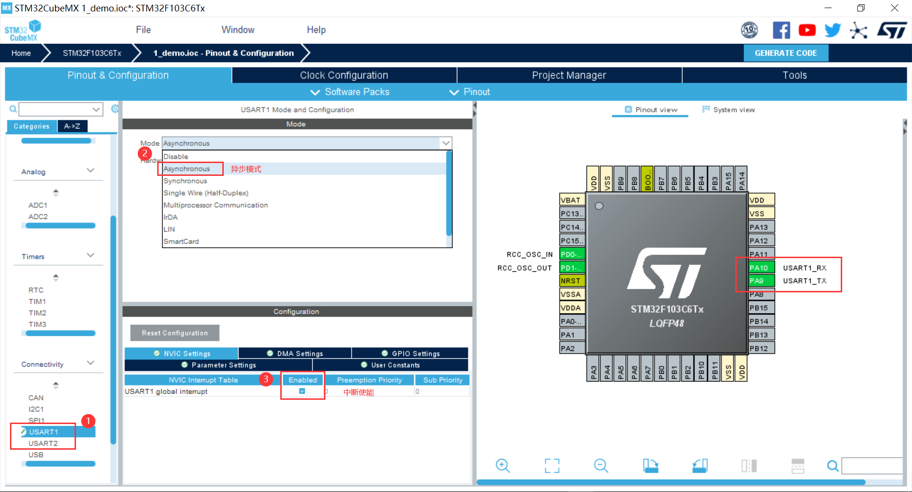

[TOC]

UART：通用异步收发器 Universal Asynchronous Receiver/Transmitter

USART：通用同步/异步串行接收/发送器 Universal Synchronous/Asynchronous Receiver/Transmitter

### 串口使能




| 模式                         |       描述       |   硬件引脚   |  支持外设   |
| :--------------------------- | :--------------: | :----------: | :---------: |
| Asynchronous                 |     异步模式     |   TXD、RXD   | USART、UART |
| Synchronous                  |     同步模式     | TXD、RXD、CK |    USART    |
| Single Wire (Half-Duplex)    |  半双工单线模式  |     TXD      | USART、UART |
| Multiprocessor Communication | 多处理器通讯模式 |   TXD、RXD   | USART、UART |
| IrDA                         |   红外解码通信   |   TXD、RXD   | USART、UART |
| LIN                          |     总线通信     |   TXD、RXD   | USART、UART |
| SmartCard                    |    智能卡模式    |     TXD      | USART、UART |
| SmartCard with Card Clock    | 带时钟智能卡模式 |   TXD、CK    |    USART    |

#### 相关函数

```c
//串口轮询模式发送,使用超时管理机制
HAL_StatusTypeDef HAL_UART_Transmit(UART_HandleTypeDef *huart, uint8_t *pData, uint16_t Size, uint32_t Timeout); 

//串口轮询模式发送,使用超时管理机制
HAL_StatusTypeDef HAL_UART_Receive(UART_HandleTypeDef *huart, uint8_t *pData, uint16_t Size, uint32_t Timeout);

//串口中断模式发送
HAL_StatusTypeDef HAL_UART_Transmit_IT(UART_HandleTypeDef *huart, uint8_t *pData, uint16_t Size);

//串口中断模式接收
HAL_StatusTypeDef HAL_UART_Receive_IT(UART_HandleTypeDef *huart, uint8_t *pData, uint16_t Size);

//串口DMA模式发送
HAL_StatusTypeDef HAL_UART_Transmit_DMA(UART_HandleTypeDef *huart, uint8_t *pData, uint16_t Size);

//串口DMA模式接收
HAL_StatusTypeDef HAL_UART_Receive_DMA(UART_HandleTypeDef *huart, uint8_t *pData, uint16_t Size);

/**
  * @param  huart Pointer to a UART_HandleTypeDef structure that contains the
  *         configuration information for the specified UART module.
  * @param  pData Pointer to data buffer (u8 or u16 data elements). 数据缓冲区指针
  * @param  Size  Amount of data elements (u8 or u16) to be received. 数据长度
  * @param  Timeout Timeout durationc 超时时间
  * @retval HAL status
  */
```

```c
//串口发送中断回调函数
void HAL_UART_TxCpltCallback(UART_HandleTypeDef *huart);

//串口发送一半中断回调函数（用的较少）
void HAL_UART_TxHalfCpltCallback(UART_HandleTypeDef *huart);

//串口接收中断回调函数
void HAL_UART_RxCpltCallback(UART_HandleTypeDef *huart);

//串口接收一半回调函数（用的较少）
void HAL_UART_RxHalfCpltCallback(UART_HandleTypeDef *huart);

//传输过程中出现错误时，通过中断处理函数调用
void HAL_UART_ErrorCallback(UART_HandleTypeDef *huart);
```

#### 使用示例


### 重定向 Printf


```c
int fputc(int ch, FILE *f){ // 重定向 printf
  HAL_UART_Transmit(&huart1, (uint8_t *)&ch, 1, 0xffff);
  return ch;
}

int fgetc(FILE *f){  // 重定向 scanf
  uint8_t ch = 0;
  HAL_UART_Receive(&huart1, &ch, 1, 0xffff);
  return ch;
}
```

#### 使用示例


