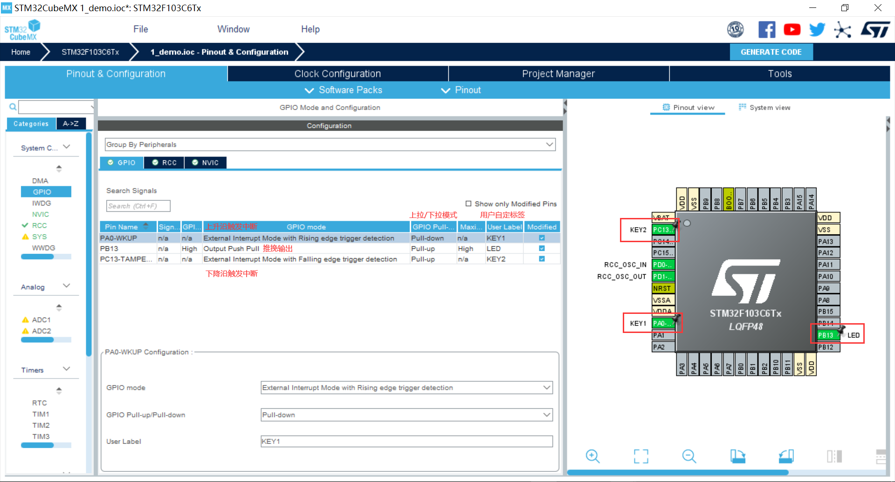
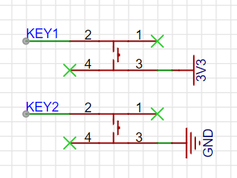
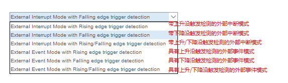
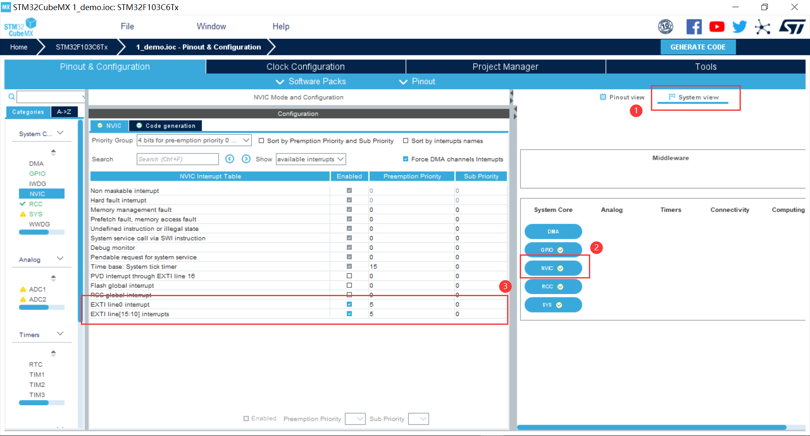
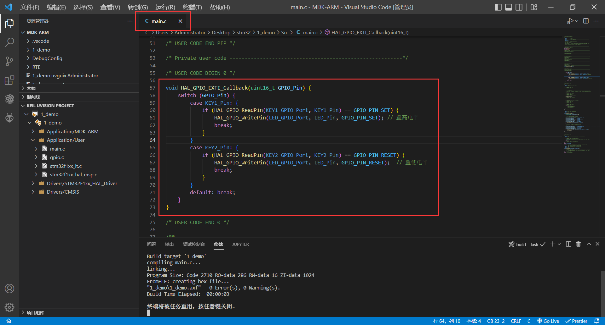

[TOC]

GPIO：General Purpose Input Output，通用输入输出

### 相关寄存器组

| 寄存器 | 说明 |
| ---- | ---- |
|GPIOx_CRL|  端口配置低寄存器（32位）|
|GPIOx_CRH |端口配置高寄存器（32位）|
|GPIOx_IDR |端口输入寄存器（32位）|
|GPIOx_ODR |端口输出寄存器（32位）|
|GPIOx_BSRR |端口位设置/清除寄存器（32位）|
|GPIOx_BRR |端口位清除寄存器（16位）|
|GPIOx_LCKR |端口配置锁存寄存器（32位）|

### 相关函数


```c
// 读取电平
GPIO_PinState HAL_GPIO_ReadPin(GPIO_TypeDef* GPIOx, uint16_t GPIO_Pin);
// 写入电平
void HAL_GPIO_WritePin(GPIO_TypeDef* GPIOx, uint16_t GPIO_Pin, GPIO_PinState PinState);
// 翻转电平
void HAL_GPIO_TogglePin(GPIO_TypeDef* GPIOx, uint16_t GPIO_Pin);
// 锁住电平
HAL_StatusTypeDef HAL_GPIO_LockPin(GPIO_TypeDef* GPIOx, uint16_t GPIO_Pin);
// 中断回调
void HAL_GPIO_EXTI_Callback(uint16_t GPIO_Pin);
```

### 外部中断 EXTI

#### 引脚配置



##### 按键原理图



##### 中断触发模式



##### 工作模式

引脚复用：默认引脚时普通IO口，复用就是使用其内置外设功能（如串口）。

| 输入模式              | 说明     |
| --------------------- | -------- |
| GPIO_Mode_IN_FLOATING | 浮空输入 |
| GPIO_Mode_IPU         | 上拉输入 |
| GPIO_Mode_IPD         | 下拉输入 |
| GPIO_Mode_AIN         | 模拟输入 |

| 输出模式              | 说明     |
| --------------------- | -------- |
|GPIO_Mode_Out_OD |开漏输出|
|GPIO_Mode_AF_OD |复用开漏输出|
|GPIO_Mode_Out_PP |推挽输出|
|GPIO_Mode_AF_PP |复用推挽输出|

| 输出速度              | 说明     |
| --------------------- | -------- |
|  低速|2MHZ|
|  中速|25MHZ|
|  快速|50MHZ|
|  高速|100MHZ|

`详细剖析`：https://blog.csdn.net/as480133937/article/details/98063549

#### 中断优先级配置

NVIC(嵌套向量中断控制器)：

使能中断和配置中断优先级（值越小优先级也高）



#### 示例代码



```c
void HAL_GPIO_EXTI_Callback(uint16_t GPIO_Pin) {
    switch (GPIO_Pin) {
        case KEY1_Pin: {
            if (HAL_GPIO_ReadPin(KEY1_GPIO_Port, KEY1_Pin) == GPIO_PIN_SET) {
                HAL_GPIO_WritePin(LED_GPIO_Port, LED_Pin, GPIO_PIN_SET); // 置高电平
                break;
            }
        }
        case KEY2_Pin: {
            if (HAL_GPIO_ReadPin(KEY2_GPIO_Port, KEY2_Pin) == GPIO_PIN_RESET) {
                HAL_GPIO_WritePin(LED_GPIO_Port, LED_Pin, GPIO_PIN_RESET);  // 置低电平
                break;
            }
        }
        default: break;
    }
}
```

