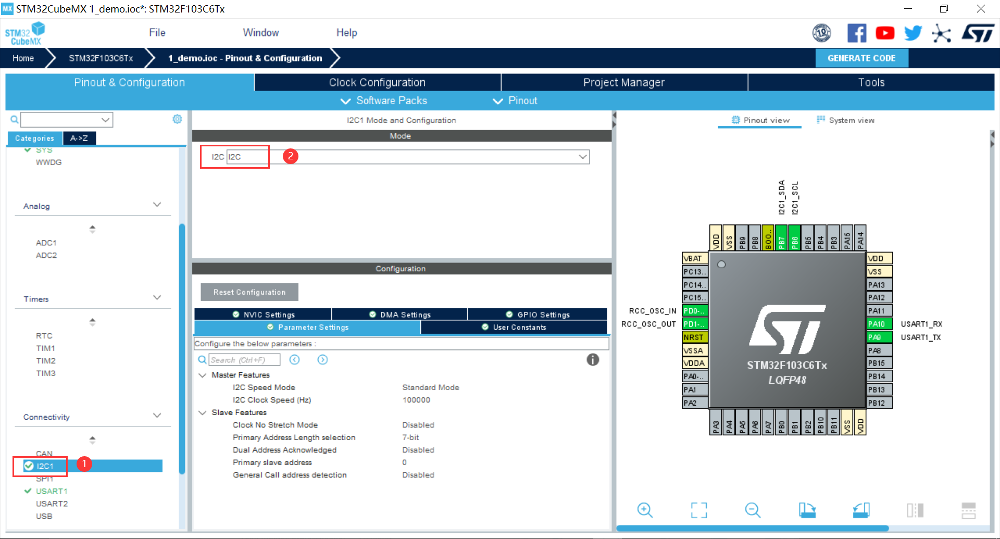
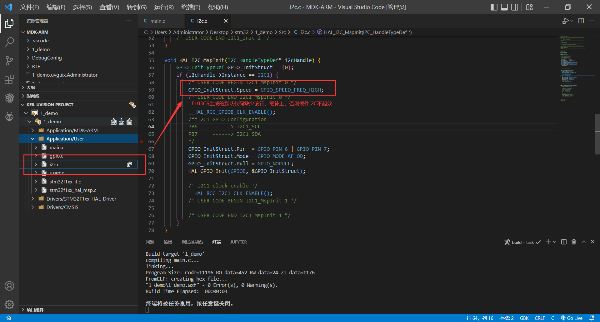

#### 相关函数

```c
// 读
HAL_StatusTypeDef HAL_I2C_Mem_Read(I2C_HandleTypeDef *hi2c, uint16_t DevAddress, uint16_t MemAddress, uint16_t MemAddSize, uint8_t *pData, uint16_t Size, uint32_t Timeout);
// 写
HAL_StatusTypeDef HAL_I2C_Mem_Write(I2C_HandleTypeDef *hi2c, uint16_t DevAddress, uint16_t MemAddress, uint16_t MemAddSize, uint8_t *pData, uint16_t Size, uint32_t Timeout);

/**
  * @param  hi2c Pointer to a I2C_HandleTypeDef structure that contains
  *         the configuration information for the specified I2C.
  * @param  DevAddress Target device address: The device 7 bits address value
  *         in datasheet must be shifted to the left before calling the interface
  *         八比特的器件地址（eg:mpu6050 0x68<<1 = 0xD0, 填 0xD0）
  * @param  MemAddress Internal memory address 寄存器地址
  * @param  MemAddSize Size of internal memory address 
  * 		寄存器地址的大小（eg:I2C_MEMADD_SIZE_8BIT）
  * @param  pData Pointer to data buffer 数据缓冲区
  * @param  Size Amount of data to be sent 数据缓冲区的字节数
  * @param  Timeout Timeout duration 超时时间（eg:0xFF）
  * @retval HAL status
  */
```

