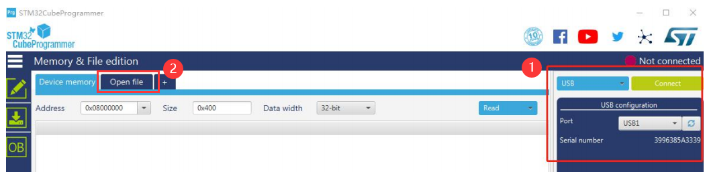

ISP 下载模式：按 boot 键，按 rst 键，松 rst 键，松 boot 键，即可进入下载模式。

芯片出厂已内置 DFU 的 BootLoader，使用 [STM32CubeProgrammer][https://www.st.com/en/development-tools/stm32cubeprog.html] 的 usb 连接模式即可烧录固件。

PS：因 stm32f401ccu6 内存小，需外挂 flash (推荐w25q32) 才可刷 micropython 固件。

